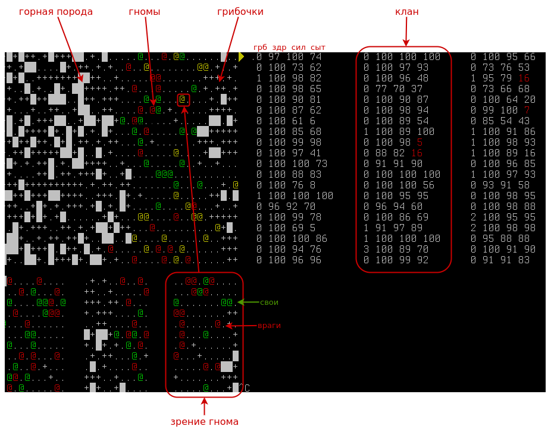

# Stollen 

Платформа моделирования поведения сферического гнома в горной породе.


# Основные объекты



## Штольня

* [Штольня][4] это горизонтальный пласт породы NxM замкнутый в тороид 
* Штольня содержит:
  * Гномов
  * Ещё гномов (те самые коварные кaмнееды)
  * Горную породу
  * Грибочки
* Штольня обеспечивает выполнение законов физики:
  * Закон сохранения грибочков - ко-во грибочков в штольне является константой.
  * Закон тапков - очередность действий гномов слуйчайна каждый тик, например если на один грибочек претендует более одного гнома, его получит самый удачливый.
  * Гном может перемещатся только на север, восток, юг и запад
  * Гном не может пройти сквозь стену (но может попытаться)
  * Тороидальную свертку - гном ушедший за край, вернется с противоположного края
  * Гном может перемещаться на одну клетку за тик
  * Параметры гнома меняются каждый тик согласно 
    * Произведенным им действиям 
    * Согласно воздействиям на него со стороны других гномов (см. киркой по голове)
  * Гнома, здоровье которого достигает 0, валькирии уносят в [Вальхаллу][3]
  * Гном может воздействовать только на ближайшие объекты
  * Если гном наступит на грибочек, он его раздавит

## Гном

> Гномы, можно сказать, знамениты своим чувством юмора. Указывая на них, люди, как правило, говорят: «У этих злобных дьяволят то ещё чувство юмора».

В нашем случае "Гном" это математическая модель дварфа в штольне.

* Модель имеет следующие праметры:
  * Силы     0-100
  * Сытость  0-100
  * Здоровье 0-100
  * Инвентарь [грибочки]
* Занятия гномов ([см. таблицу][1])
  * Копать породу
  * Отдыхать
  * Ходить туда сюда
  * Кушать грибочки
  * Собирать грибочки
  * Бить других гномов киркой
* Каждый тик, гном становится голоднее
* Голодный гном теряет здоровье (1/10 от силы голода)
* Каждое активное действие гнома однимает силы ([см. таблицу][1])
* Отдых восстанавливают энергию и здоровье
* Грибочки устраняют голод, восстанавливают силы, здоровье ([см. таблицу][2]) 

## Грибочки

В мире всегда есть **МAX_MUSHROOMS** грибов, как только один гриб съеден/взят, в мире появляется новый, в случайном месте.
Гном может подбирать грибы и носить их с собой, съедая по необходимости.

## Киркой по голове

> Дуббинс вёл себя слишком уж вежливо. А если гном ведёт себя вежливо, значит, он копит силы, чтобы потом вести себя очень скверно.

Гном может воздействовать на других, рядом стоящих существ, нанося им поправимый урон здоровья при помощи кирки.
Наносимый урон состаявляет **1D10** здоровья.

## Кланы

Гномы объеденены в кланы, все гномы одного клана управляются одним AI

# AI

AI представляет из себя черный ящик, функцию, на вход которой подается гном и его ближайшее окружение.
На выходе ожидается получить действие которое гному необходимо совершить следующим.

Простейший AI может выглядеть так:

```
sleeping_dwarf_ai = (dwarf)->"rest"
```

Или так:

```
fooling_arround_dwarf_ai = (dwarf)->["n", "e", "s", "w", "eat", "rest"][Math.random()*6|0]
```

**Собственно смысл всего этого проекта - получить качественный AI, не только позволяющий гномам выживать, но и побеждать другие кланы.**


[1]: https://github.com/peko/stollen/blob/master/stollen/config.coffee#L12
[2]: https://github.com/peko/stollen/blob/master/stollen/config.coffee#L8
[3]: https://ru.wikipedia.org/wiki/%D0%92%D0%B0%D0%BB%D1%8C%D1%85%D0%B0%D0%BB%D0%BB%D0%B0
[4]: http://miningwiki.ru/wiki/%D0%A8%D0%B0%D1%85%D1%82%D1%91%D1%80%D1%81%D0%BA%D0%B8%D0%B9_%D0%B6%D0%B0%D1%80%D0%B3%D0%BE%D0%BD#.D0.A8

