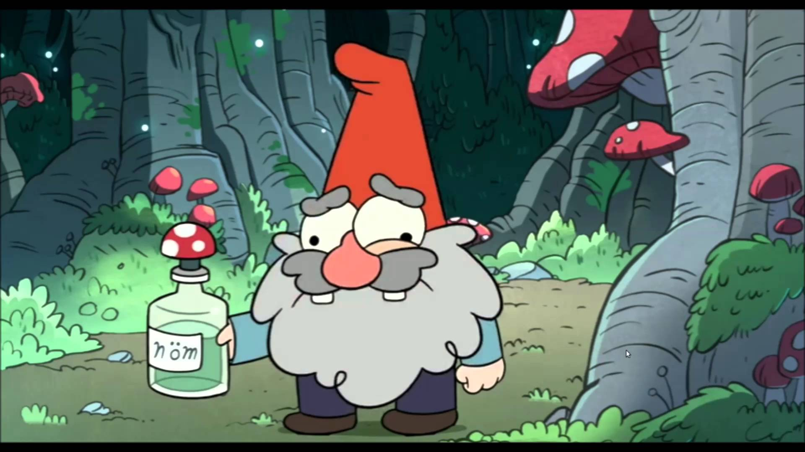

# Тридцать два гнома

Поведенческая модель гнома



# Основные объекты

## Мир

* Мир это тороидальное 2D поле NxM клеток
* Мир содержит:
  * Гномов
  * Пещеры
  * Горную породу
  * Грибочки

## Гном

Гном это математическая модель гнома в забое

* Модель гнома имеет следующие праметры:
  * Силы     0-100
  * Сытость  0-100
  * Здоровье 0-100
  * Инвентарь [грибочки]
* Занятия гномов ([см. таблицу][1])
  * Копать породу
  * Отдыхать
  * Ходить туда сюда
  * Кушать грибочки
  * Собирать грибочки
  * Бить других гномов киркой
* Каждый тик, гном становится голоднее
* Голодный гном теряет здоровье (1/10 от силы голода)
* Каждое активное действие гнома однимает силы ([см. таблицу][1])
* Отдых и грибочки восстанавливают энергию, здоровье и конечно устраняют голод ([см. таблицу][2]) 


## Кланы

Гномы мира объеденены в кланы, все гномы одного клана управляются одним AI

# AI

AI представляет из себя черный ящик, функцию, на вход которой подается гном и его ближайшее окружение.
На выходе ожидается получить действие которое гному необходимо совершить следующим.

Простейший AI может выглядеть так:

```
sleeping_dwarf_ai = (dwarf)->"rest"
```

Или так:

```
fooling_arround_dwarf_ai = (dwarf)->["n", "e", "s", "w", "eat", "rest"][Math.random()*6|0]
```

**Собственно смысл всего этого проекта - получить качественный AI, не только позволяющий гномам выживать, но и побеждать другие кланы.**

## Грибочки

В мире всегда есть **МAX_MUSHROOMS** грибов, как только один гриб съеден/взят, в мире появляется новый в случайном месте
Гном может подбирать грибы и носить их с собой, съедая по необходимости.


[1]: https://github.com/peko/32D/blob/master/config.coffee#L12
[2]: https://github.com/peko/32D/blob/master/config.coffee#L8
